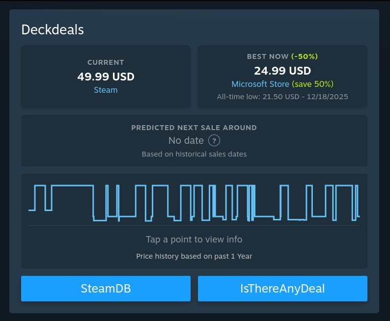
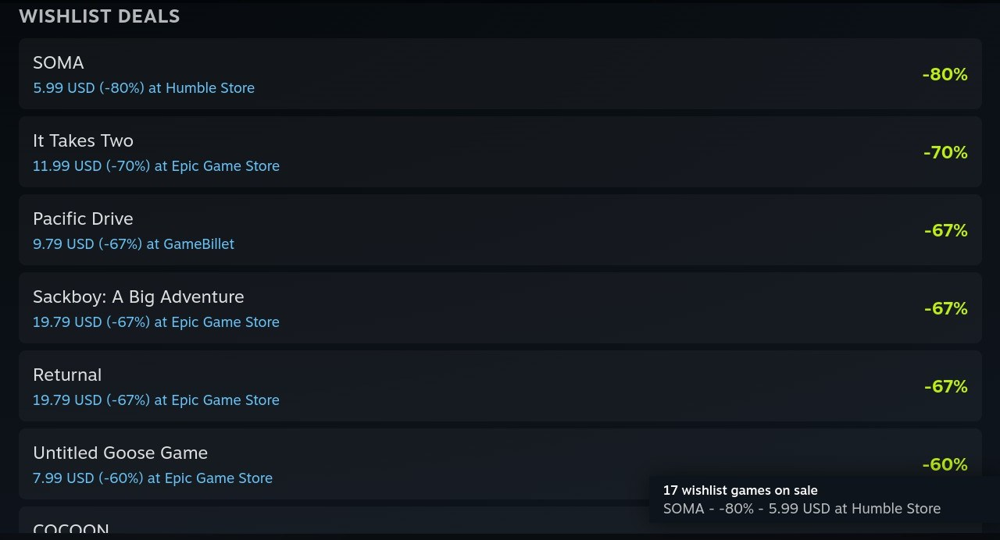

<div align="center">

# Deckdeals
### Price History & Deals (BETA)


**Track prices, spot deals, and save money directly from the Steam Store.**

  <a href="https://github.com/ebdevag/optideck-deckdeals/releases/download/v1.1.1-beta/optideck-deckdeals-v1.1.1-beta.zip">
    
  </a>
</p>

</div>

---

> [!NOTE]
> This is a **BETA** build. Features and UI are subject to change. I'm hoping to submit this to Decky shortly after I've had time to polish it to the fullest.

## Installation

You can install the plugin manually via the ZIP file:

1. Download the [optideck-deckdeals-v1.1.1-beta.zip](https://github.com/ebdevag/optideck-deckdeals/releases/download/v1.1.1-beta/optideck-deckdeals-v1.1.1-beta.zip) (or fork the repo and zip it yourself).
   - Fork/build guide: [`.github/DOCUMENTATION/FORK_AND_BUILD_ZIP.md`](.github/DOCUMENTATION/FORK_AND_BUILD_ZIP.md)
2. On your Steam Deck, go to **Decky Options**.
3. Enable **Developer Mode** (via the General tab).
4. Go to the **Developer Tab**.
5. Select **Install Plugin from ZIP File** and choose the downloaded file.

## Features

- **Store Page Integration**: Price information is injected directly into the Steam store page.
- **Best Price Right Now**: The headline figure is the cheapest price you can actually pay today across every selected store - not an all-time low you can no longer buy at. The historic low is kept underneath as context.
- **Price Comparison**: Displays current prices from Steam and ~30 supported alternative providers, all enabled by default.
- **Wishlist Alerts**: Notifies you when a game on your Steam wishlist goes on sale at *any* supported store, not just on Steam.
- **Price History**: Tracks historical lows and includes price trend graphs.
- **Next Sale Prediction**: Estimates upcoming sales using 5 years of historical price data (regardless of the displayed period).
- **Currency Normalization**: Uses daily exchange rates for price comparison across different store currencies.
- **Regional Support**: Compatible with all major Steam regions and localized currencies.
- **Quick Links**: Buttons for SteamDB and IsThereAnyDeal pages.

## Screenshots

**Best price right now**, on the store page - Steam wants 49.99, the Microsoft Store has it for 24.99. The all-time low sits underneath as context.



**Wishlist Deals** - every wishlisted game found on sale at any store, with the notification that opened the list.



## How it Works & API Usage

To provide accurate and up-to-date information, Deckdeals interacts with the following services:

| Service | Purpose | Data Sent |
| :--- | :--- | :--- |
| **Optideck API** (`api.optideck.gg`) | Fetches managed API keys for price and currency services. | Custom `X-App-ID` header for authentication |
| **IsThereAnyDeal** (`isthereanydeal.com`) | Retrieves current prices, historic lows, and graph data. | AppID, Country Code, Store IDs |
| **ExchangeRate-API** (`exchangerate-api.com`) | Fetches daily exchange rates for accurate price normalization. | Target Currency |
| **Steam Web API** (`api.steampowered.com`) | Reads your public wishlist for deal alerts (only when Wishlist Alerts is enabled). | Your SteamID64 |

All requests are made locally from your Steam Deck using Decky's secure network layer. Your Steam account data, inventory, and personal information are **never** accessed or shared.

### Wishlist Alerts

Wishlist Alerts reads your wishlist from Steam's public wishlist API using the SteamID of the signed-in account. This requires your Steam wishlist to be **public** (Steam Profile → Privacy Settings → *Game details*). Your SteamID is sent only to Steam's own API, and no wishlist data leaves your device.

**When you are notified**

- Checks run on a configurable interval (default: every 6 hours), and on demand via **Check Now**.
- The **first** check records what is already on sale *without* notifying you. Across ~30 stores something is always discounted, so announcing that backlog would present weeks-old deals as news. From then on, an alert means a sale genuinely started.
- Games added to your wishlist later while already on sale, and discounts that deepen, still alert normally.
- Each deal is announced once per price. A sale that ends and later returns is announced again.
- Up to three games are announced individually; beyond that you get a single summary.

**Where a notification takes you**

- A single-game notification opens that game's Steam store page, where the Deckdeals module shows the full cross-store comparison.
- A summary notification opens the **Wishlist Deals** list: every game found on sale with its best price, discount and store. Selecting one opens its Steam store page.
- The list is available any time from **View Deals List** in the plugin settings.

**Controls**

- **Minimum Discount** - ignore anything shallower.
- **Check Frequency** - how often the background check runs.
- **Reset Alert History** - forget what you have been told, so the next check reports every current sale again.

## Development

Build the frontend bundle:

```bash
pnpm install
pnpm build
```

Run the tests and type checker:

```bash
pnpm test        # unit + end-to-end service tests
pnpm typecheck   # tsc --noEmit
```

Tests cover two layers:

- **Pure logic** (`src/utils`) - deal normalization, which offer triggers a wishlist alert, notification de-duplication and first-run seeding, deals-list ordering, and validation of everything arriving from an external API.
- **The wishlist flow end to end** (`src/service/WishlistService.test.ts`) - driven through a fake `ServerAPI`, so a sale can be made to start, deepen, lapse and return, and the resulting notification asserted, without waiting on a real sale.

`decky-frontend-lib` cannot load outside the Steam client, so vitest aliases it to a stub (`src/test/`) that records navigation calls. Only the Steam Store DOM injection and on-screen rendering need a real device.

> **Note:** `@types/node` is pinned to v18 because TypeScript 4.7 cannot parse newer versions - it fails with syntax errors in the `.d.ts` and aborts before reaching `src/`, silently disabling type checking for the whole project. Run `pnpm typecheck` and confirm it reports errors in `src/` paths, not in `node_modules`.

## Security Review

For security reviewers and advanced users, start with:

- [Security Review Notes](./.github/DOCUMENTATION/SECURITY_REVIEW.md)

This document includes:
- File-by-file responsibilities.
- Settings persistence and privacy scope.
- Operational logging policy.
- External API response hardening and fail-closed behavior.

## Roadmap & Planned Features

- [ ] Support for more store data providers.
- [ ] Additional languages and localizations.
- [ ] Wishlist page compatibility.
- [ ] Ability to customize and move the info box to different locations on the store page.

## Contributing

Contributions of translations and new additions are very welcome!

1. Copy `src/l10n/template.ts` → `src/l10n/<lang>.ts` (e.g. `de.ts`).
2. Fill in all translated strings in the template.
3. Import your file in `src/l10n/index.ts` and add it to the `locales` map.
4. Submit a pull request.

---

<div align="center">

<sub>Managed by **Optideck & Draftdev (Author)**</sub><br>
<sub>Special thanks to the <a href="https://github.com/IsThereAnyDeal/AugmentedSteam/wiki/ITAD-API">ITAD API</a>, <a href="https://www.exchangerate-api.com/">ExchangeRate-API</a>, and the original <a href="https://github.com/JtdeGraaf/IsThereAnyDeal-DeckyPlugin">IsThereAnyDeal Decky Plugin</a> by JtdeGraaf</sub>

</div>
